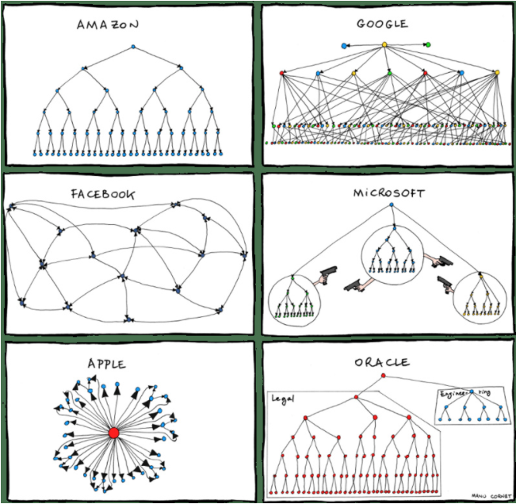
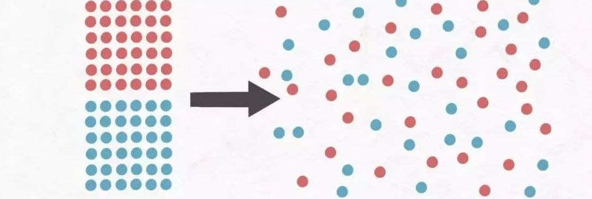

# 架构师不可不知的3个定律

:::tip 架构师的自我修养！

Soft skills are always hard than hard skills. 软技能比硬技能难。

:::right

:::

### 康威定律

>organizations which design systems ... are constrained to produce designs which are copies of the communication structures of these organizations. — M. Conway
 一个组织的系统通常被设计成这个组织通信结构的副本——Melvin Conway(1967)

 大致意思是设计系统的企业，它们生产的设计等同于企业内的沟通结构。

 根据康威定律引申出四条定律：

 第一定律 Communication dictates design

 组织沟通方式会通过系统设计表达出来！

如果工作经验丰富的同学应该很容易感受的到，根据组织架构不同，系统的交互方式也有所不同。因为边界划分不同，导致职责不同。

 第二定律 There is never enough time to do something right, but there is always enough time to do it over

 时间再多一件事情也不可能做的完美，但总有时间做完一件事情

  其中：敏捷开发巨头之一Erik Hollnagel （2009）在他的书中阐述了类似的观点：

    1）问题太复杂？那么不妨忽略不必要的细节；
    
    2）没有足够的资源？放弃无用的功能；

 之所以互联网从业者那么多996，就是由于这个的原因。没有100%的完美，只有100%的完成！任何一个设计方案都有其优点，也有其弊端。时间足够多，讨论的做够多决定的就比较慢，时间不够多，讨论的就相对少，决定的比较快。

第三定律 There is a homomorphism from the linear graph of a system to the linear graph of its design organization

 线型系统和线型组织架构间有潜在的异质同态特性。

需要前后端分离的系统就搭建前后端分离的团队，反之，拥有前后端分离的团队，可以设计前后端分离的系统。

 第四定律 The structures of large systems tend to disintegrate during development, qualitatively more so than with small systems

 大的系统组织总是比小系统更倾向于分解。

系统越复杂，越需要增加人手，人手越多，沟通成本也呈指数增长。分而治之便是大多数公司选择的解决方案。分不同的层级，分不同的小团队，让团队内部完成自治理，然后统一对外沟通。

### 墨菲定律

>If there are two or more ways to do something, and one of those ways can result in a catastrophe, then someone will do it.
>（如果有两种或两种以上的方式去做某件事情，而其中一种选择方式将导致灾难，则必定有人会作出这种选择。）

　它道出了一个事实：**技术风险**能够由可能性变为突发性的事实。不要存有任何侥幸心理！

　根据“墨菲定律”可以得出4条结论：

　　一、任何事都没有表面看起来那么简单；

　　二、所有的事都会比你预计的时间长；

　　三、会出错的事总会出错；

　　四、如果你担心某种情况发生，那么它就更有可能发生。

对待这个定律，安全管理者存在着两种截然不同的态度：一种是消极的态度，认为既然差错是不可避免的，事故迟早会发生，那么，管理者就难有作为；另一种是积极的态度，认为差错虽不可避免，事故迟早要发生的，那么安全管理者就不能有丝毫放松的思想，要时刻提高警觉，防止事故发生，保证安全。所以我们在事前应该是尽可能地想得周到、全面一些，如果真的发生不幸或者损失，就笑着应对吧，关键在于总结所犯的错误，而不是企图掩盖它。

可喜的是，人们在这种理论的督促下，犯错误的可能越来越少，当少到一定程度的时候从概率学的角度就可以忽略不计。比如系统稳定性达到6个9的时候，我们就认为是非常稳定的了。

### 熵增定律

>熵增定律是热力学定律，其引入了熵的概念来描述一种不可逆过程，即热量从高温物体流向低温物体是不可逆的，孤立系统熵只能增大，或者不变，绝不能减小，最终达到熵的最大状态，也就是系统的最混乱无序状态。

“熵”，就是事物的混乱/无序程度，在孤立系统下，熵是不断增加的，当熵达到最大值时，系统会出现严重混乱，最后走向死亡。

在软件开发过程中产生熵增的原因有：

  一、人员的惰性，导致有一些小的问题或不规范容易忽略，导致熵增；

  二、需求的变动，导致之前的设计需要做适配，从而会让代码越来越乱，导致熵增；

  三、人员的变动，后来人对前人的不满或者不了解，代码改动起来不符合自己的习惯，从而导致软件的熵增；

  四、业务的压力，与需求的变更导致软件代码越来越乱没有时间整理，从而形成一种恶性循环。

那么如何减少熵增呢？

从"**孤立系统**"入手，让系统不再孤立。那就必须要有外界干预。

以一幢有少许破窗的建筑为例，如果那些窗不被修理好，可能将会有破坏者破坏更多的窗户。最终破坏者甚至会闯入建筑内，如果发现无人居住，甚至就在里面定居或者纵火。在相当短的一段时间内，建筑就会以惊人的速度被破坏掉，而且业主也不愿意去修理这个破烂的房子了。这就是著名的**破窗理论**。

对应到软件开发领域时，这个”破窗户“，可能是工程师不经意间留下，可能是考虑不周导致，可能是低劣的设计遗留，也可能是错误的需求导致。

不要留着“破窗户”，见到一个就修一个。以此来减少**熵增**。

熵增定律不只是应用在软件业，对于一个企业，一个组织，甚至是一个个人同样适用。

 
