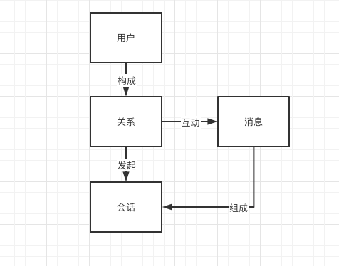
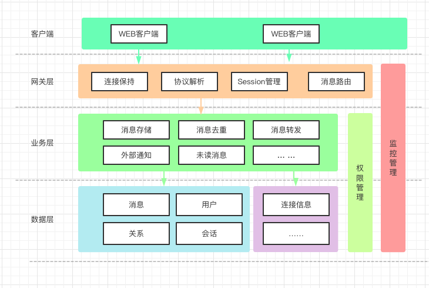
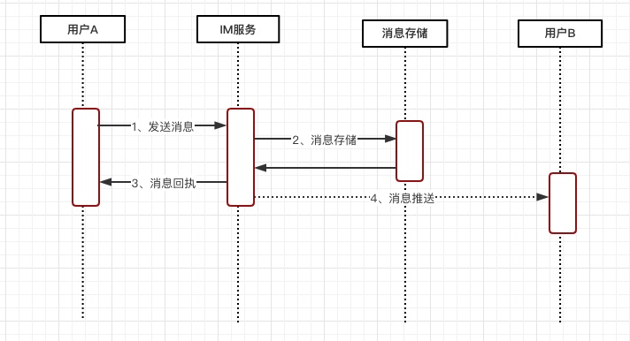
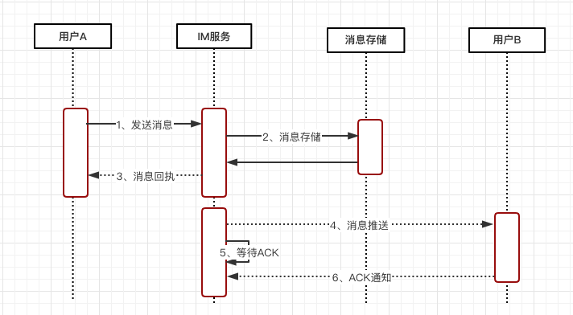
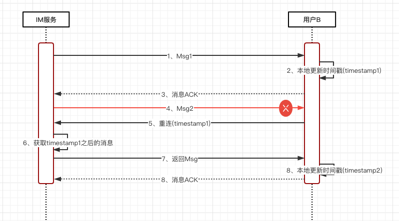
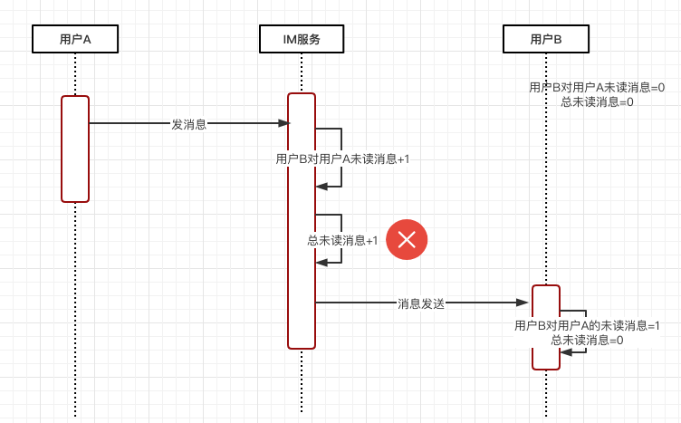
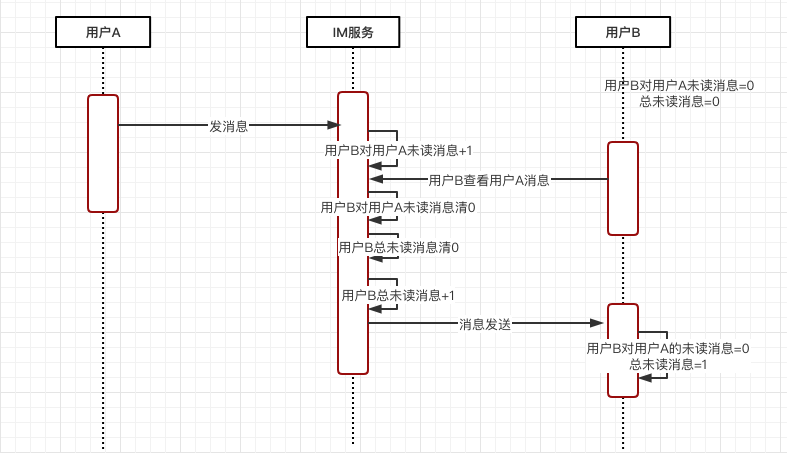

# 在线IM系统设计

:::tip 沟通的效率提升，成本下降！

  IM，在整个互联网生态无处不在

:::right

:::
# IM即时通讯

## IM基本要素

:::center

:::

 ###  账号

- 用户信息
- 机器人账号
- 系统账号

###  关系

- 好友关系
- 群组关系

### 消息

- 聊天消息
- 事件消息
- 心跳消息
- 系统消息

### 会话

- 发起会话
- 接起会话
- 转接会话
- 关闭会话
- ……

## IM系统架构

:::center

:::
### 客户端

- WEB
- Android
- IOS
- PC
- ……

### 网关层

- 连接保持
- 协议解析：聊天消息、心跳消息……
- Session管理
- 消息路由
- ……

### 业务层

- 消息存储
- 消息去重
- 消息转发
- 外部通知：离线通知、业务通知

### 存储层

- MySQL
- Redis
- Hbase

## IM要求特性

### 实时性

  定时查找：短轮训

  减少定时：长轮训

  最终选择：长链接

#### websocket

  1、支持服务端推送的双向通信，大幅降低服务端轮询压力； 
  2、数据交互的控制开销低，降低双方通信的网络开销； 
  3、Web 原生支持，实现相对简单。

[代码参考](<https://github.com/itliwei/kagaya>)

### 安全性

#### 1.消息传输安全性

常用协议参考：[主流IM协议简介](https://www.cnblogs.com/dubo-/p/5586037.html)

:::quote 常用协议
XMPP 协议虽然比较成熟、扩展性也不错，但基于 XML 格式的协议传输上冗余比较多，在流量方面不太友好，而且整体实现上比较复杂，在如今移动网络场景下用得并不多。 
MQTT 基于代理的“发布 / 订阅”模式，在省流量和扩展性方面都比较突出，在很多消息推送场景下被广泛使用，但这个协议并不是 IM 领域的专有协议，因此对于很多 IM 下的个性化业务场景仍然需要大量复杂的扩展和开发，比如不支持群组功能、不支持离线消息。
:::

-  私有协议
-  TLS 传输层加密协议

#### 2.消息存储安全性

- 账号密码安全

  “单向散列”算法加密

- 消息不存储(国内基本做不到)

#### 3.消息内容安全性

- 敏感词校验。

:::quote 参考内容
  [代码参考](<https://github.com/elulis/sensitive-words>)

  [原理参考](<https://www.cnblogs.com/bytecodebuffer/p/14486877.html>)
:::

- 对色情图片和视频、广告图片、涉政图片等进行识别。

:::quote 参考内容
  [代码参考](<https://github.com/nguyenq/tess4j>)

  [原理参考](<https://zhuanlan.zhihu.com/p/121074333>)
:::

- 通过爬虫技术来对链接内容进行进一步分析，识别“风险外链”。

### 可靠性

一般包括两个方面：

- 不丢消息。

  “丢消息”是互动中让人难以接受的 Bug，某些场景下可能导致业务可用性差，甚至不可用的情况。

- 消息不重复。

  消息重复不仅会对用户造成不必要的骚扰和困惑，可能还会导致比较严重的业务异常。

#### 消息流转图
:::center

:::
#### 两步解决

**第一步**：客户端 A 发送消息到 IM 服务器，服务器将消息暂存，然后返回成功的结果给发送方 A（步骤 1、2、3）；

- 1过程A设备发送没有发到服务端
- 2过程达到服务器处理失败了
- 2过程处理成功了，3过程回执失败了

##### 解决思路：

- 客户端A超时重发

- 服务端消息去重

**第二步**：IM 服务器接着再将暂存的客户端 A 发出的消息，推送给接收方用户 B（步骤 4）。

- 服务器异常没有发送
- B设备异常没有接收
- B接收后没有处理好就挂了

##### 解决思路：

- 业务ACK机制
:::center

:::
IM 服务器的“等待 ACK 队列”一般都会维护一个超时计时器，一定时间内如果没有收到用户 B 回的 ACK 包，会从“等待 ACK 队列”中重新取出那条消息进行重推。

**通过这个方式真的可以解决吗？**

设想一下，假设一台 IM 服务器在推送出消息后，由于硬件原因宕机了，这种情况下，如果这条消息真的丢了，由于负责的 IM 服务器宕机了无法触发重传，导致接收方 B 收不到这条消息。

**如何解决呢？**

​	分布式定时查询补偿？实时性和性能都有问题。

- 客户端主动拉取
:::center
  
:::

### 一致性

​	同一条消息，在多人、多终端需要保证展现顺序的一致性。

:::quote 问题描述
​单聊场景，时序一致性需要保证接收方的接收顺序和发送方的发出顺序一致；

群聊场景，时序一致性保证的是群里所有接收人看到的消息展现顺序都一样。
:::

#### 难点分析：

​	多发送方、多接收方、服务端多线程、服务端集群部署。

#### 如何解决?

​	找到一个核心的**时序基准**。可以是时间戳，也可以是序列号。前提是保证其有序。

**客户端时序**

- 客户端时钟不靠谱
- 客户端本地序号不靠谱
- 单用户多点登录

**服务器时序**

- 服务端集群化部署

:::quote NTP服务器间时间差异

  多台服务器通过 NTP 时间同步服务，能降低服务集群机器间的时钟差异到毫秒级别，但仍然还是存在一定的时钟误差。
:::

  更多内容参考：[分布式系统一致性的发展历史](https://www.36kr.com/p/1720928927745)

**全局时钟**

​	这种“全局序号生成器”可以通过多种方式来实现，常见的比如 Redis 的原子自增命令 incr，DB 自带的自增 id，或者类似 Twitter 的 snowflake 算法、“时间相关”的分布式序号生成服务等。

- 性能问题

:::quote 分布式自增ID

  类似 Redis 的原子自增和 DB 的自增 id，都要求在主库上来执行“取号”操作，而主库基本都是单点部署，在可用性上的保障会相对较差，另外，针对高并发的取号操作这个单点的主库可能容易出现性能瓶颈。

  类似 snowflake 算法的时间相关的分布式“序号生成器”，虽然在发号性能上一般问题不大，但也存在一些问题。
:::

#### 回归需求本身：

​	群聊和多点登录这种场景，没有必要保证全局的跨多个群的绝对时序性，只需要保证某一个群的消息有序即可。（每一个群有独立一个“序号生成器”）

​	可以接受消息时序上存在一定的细微误差，比如同一秒收到同一个群的多条消息，业务上是可以接受这一秒的多条消息。（秒级别的误差可以接受）

:::quote 业界实现方案
微信的聊天和朋友圈的消息时序也是通过一个“递增”的版本号服务来进行实现的。
微博的消息箱则是依赖“分布式的时间相关的 ID 生成器”来对私信、群聊等业务进行排序，目前的精度能保证秒间有序。
:::

​	所以，我们可以选取 **多集群的全局时钟**。兼顾时序性和性能。

#### 这就解决了吗？

- IM 服务器都是集群化部署，每台服务器的机器性能存在差异，因此处理效率有差别，并不能保证先到的消息一定可以先推送到接收方，比如有的服务器处理得慢，或者刚好碰到一次 GC，导致它接收的更早消息，反而比其他处理更快的机器更晚推送出去。
- IM 服务端接收到发送方的消息后，之后相应的处理一般都是多线程进行处理的，比如“取序号”“存储消息”“查询接收方连接信息”“发送消息”等，由于多线程处理流程，并不能保证先取到序号的消息能先到达接收方，这样的话对于多个接收方看到的消息顺序可能是不一致的。

**消息整流**

所谓消息整流，是指将一些消息整理好顺序，然后一起发送。保证消息在一个批次内有序。

**客户端整流**

1. 下推消息时，连同消息和序号一起推送给接收方；
2. 接收方收到消息后进行判定，如果当前消息序号大于前一条消息的序号就将当前消息追加在会话里；
3. 否则继续往前查找倒数第二条、第三条等，一直查找到恰好小于当前推送消息的那条消息，然后插入在其后展示。

**服务端整流**

1. 首先，生产者为每个消息包生成一个 packageID，为包内的每条消息加个有序自增的 seqId。
2. 其次，消费者根据每条消息的 packageID 和 seqID 进行整流，最终执行模块只有在一定超时时间内完整有序地收到所有消息才执行最终操作，否则将根据业务需要触发重试或者直接放弃操作。通过服务端整流，服务端包内整流大概就是图中这个样子，我们要做的是在最终服务器取到 TCP 连接后下推的时候，根据包的 ID，对一定时间内的消息做一个整流和排序，这样即使服务端处理多条消息时出现乱序，仍然可以在最终推送给客户端时整流为有序的。

## IM高级设计

 ### 功能设计

#### 未读消息数

​	会话未读：当前用户和某一个聊天方的未读消息数。

​	总未读：当前用户的所有未读消息数，所有会话未读数的总和。

**总未读数单独维护还是不维护？**

不维护：根据会话未读数求和

问题：

​	1、总未读一般高频使用，每次查的话有性能压力

​	2、如果查的过程中有一个会话(公众号消息等)查询失败，会造成计数错误。

出于以上考虑，总未读数和会话未读数一般是单独维护的。

单独维护：

问题：

​	1、如何保证未读数的一致性。

##### 如何维护？

场景一：事务一致性问题
:::center
​		
:::
场景二：顺序一致性问题
:::center
​		
:::
**分布式锁**

​	Redis 的 setNX ，ZK的临时节点等。

问题：

1.性能问题
2.死锁问题

**事务**

​	Redis 通过 MULTI、DISCARD 、EXEC 和 WATCH 四个命令来支持事务操作。

问题：

这个方案在性能上还是存在一定的问题，由于 watch 操作实际是一个乐观锁策略，对于未读变更较频繁的场景下（比如一个很火的群里大家发言很频繁），可能需要多次重试才可以最终执行成功，这种情况下执行效率低，性能上也会比较差。

**原子化嵌入脚本**

​	Redis 就支持通过嵌入 Lua 脚本来原子化执行多条语句。

问题：
1.实现复杂，需要一定的学习成本；
2.Redis 本身是服务端单线程模型，Lua 脚本中尽量不要有远程访问和其他耗时的操作，以免长时间Hang住，导致整个资源不可用。

#### 多端漫游
### 高可用设计
#### 扩缩容
#### 扩容

**如何扩容？**

#### 缩容

**如何缩容？**

#### 降级限流

##### 业务降级

**点赞业务降级**

**点赞业务降级**

##### 业务限流

**每30s能发表一次言论**

#### 分库分表
##### 消息表的设计

**消息索引表多份存储**

#### 监控
##### 系统监控
**服务器指标监控**

**数据库监控**

**Redis监控**

**MQ监控**

##### 业务监控

**5分钟回复率**

**连接数监控**

**会话量监控**

