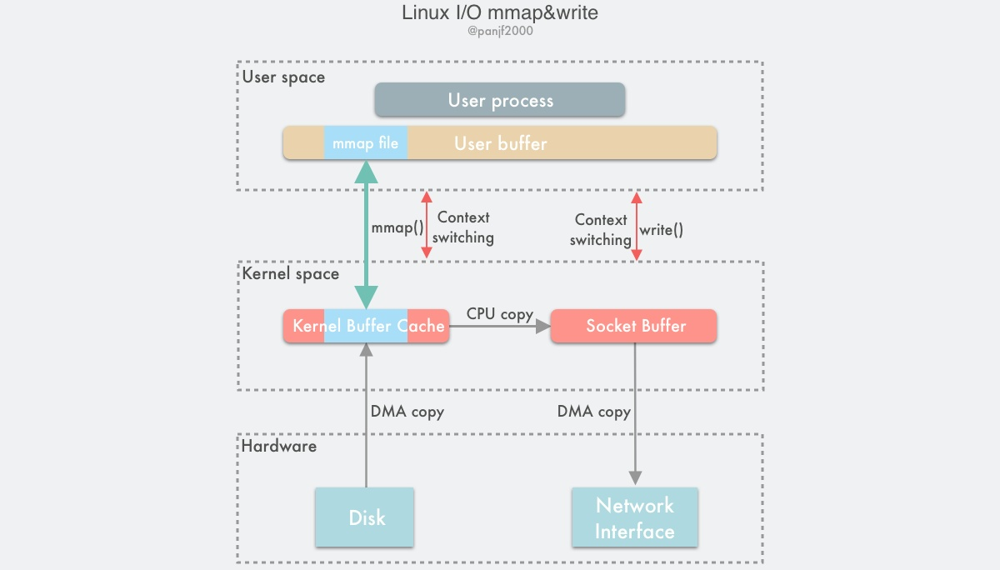
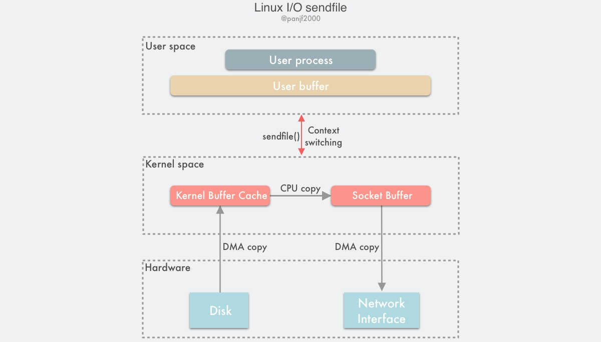
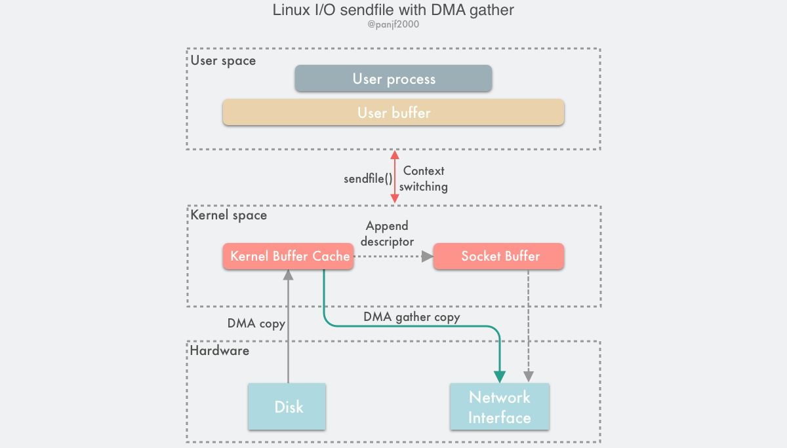

## 零拷贝

我们在讲Redis、Kafka、RocketMQ的时候不停的在说零拷贝，然而究竟什么是零拷贝呢，所谓的0是指在那里0，所谓的copy又是从哪里copy到哪里呢？今天我们就来一探究竟。

## 传统 I/O 读写模式

首先介绍一下传统I/O Copy是什么呢？在介绍I/O Copy之前，需要先介绍下Linux操作系统的一些基本概念。

Linux 操作系统的体系架构分为用户态和内核态（或者用户空间和内核）。内核可以理解为系统资源。用户空间可以理解为用户应用程序 (进程) 的执行必须依托于内核提供的资源。

Linux 中传统的 I/O 读写是通过 `read()/write()` 系统调用完成的，`read()` 把数据从存储器 (磁盘、网卡等) 读取到用户空间，`write()` 则是把数据从用户空间写出到存储器。一次完整的读磁盘文件然后写出到网卡的底层传输过程如下：
:::center

:::
整个过程如下：

1. 从硬盘 经过 DMA 拷贝 到 kernel buffer （内核buferr）

2.  从kernel buffer 经过cpu 拷贝到 user buffer 

3. 从user buffer 拷贝到 socket buffer 

4. 从socket buffer 拷贝到 Network.

一共经历了4次Copy。同时也经历了3次状态切换

​	第一次状态切换： 用户态---》 内核态 

​	第二次状态切换： 内核态---》 用户态

​	第三次状态切换： 用户态---》 内核态

在此过程中，如果没有对文件内容做任何修改，那么在内核空间和用户空间来回拷贝数据无疑就是一种浪费，同时频繁的上下文切换也是对系统资源的一个损耗。而零拷贝主要就是为了解决这种低效性！

这里说的DMA是什么呢？DMA 全称是 Direct Memory Access，也即直接存储器存取，是一种用来提供在外设和存储器之间或者存储器和存储器之间的高速数据传输。如果没有DMA，数据之间的传输依然是需要CPU的参与，而使用了DMMA则整个过程无须 CPU 参与，数据直接通过 DMA 控制器进行快速地移动拷贝，节省 CPU 的资源去做其他工作。

## 零拷贝 (Zero-copy)的实现方式

维基百科中对于Zero-copy的定义如下：

> "**Zero-copy**" describes computer operations in which the **CPU** does not perform the task of copying data from one **memory** area to another. This is frequently used to save CPU cycles and memory bandwidth when transmitting a file over a network.

**零复制**（英语：**Zero-copy**；也译**零拷贝**）技术是指计算机执行操作时，CPU不需要先将数据从某处内存复制到另一个特定区域。这种技术通常用于通过网络传输文件时节省CPU周期和内存带宽。

所以，总结一下：零拷贝技术的目标就是避免不必要的系统调用和上下文切换。那么做到如何避免呢？我们可以想象一下，不难得出避免的有效方式是：共用。不能共用的时候，我们再copy。所以可以从一下几点出发：

​	1.避免操作系统内核缓冲区之间进行数据拷贝操作。

​	2.避免操作系统内核和用户应用程序地址空间这两者之间进行数据拷贝操作。

​	3.用户应用程序可以避开操作系统直接访问硬件存储。

​	4.数据传输尽量让 DMA 来做。

好了，Zero-copy这么优秀，我们该怎么实现Zero-copy呢？这依然是使用到了Linux的底层实现。

### mmap()

`mmap()` 即：内存映射（memory map）,就是将用户空间的一段内存缓冲区（user buffer）映射到文件所在的内核缓冲区（kernel buffer）上，从而减少CPU的copy。如图所示：
:::center

:::
利用 `mmap()` 替换 `read()`，配合 `write()` 完成整个I/O：

1. 用户进程调用 `mmap()`，从用户态进入内核态，将内核缓冲区映射到用户缓存区；
2. DMA 控制器将数据从硬盘**拷贝**到内核缓冲区；
3. `mmap()` 返回，上下文从内核态切换回用户态；
4. 用户进程调用 `write()`，尝试把文件数据写到内核里的套接字缓冲区，再次进入内核态；
5. CPU 将内核缓冲区中的数据**拷贝**到的套接字缓冲区；
6. DMA 控制器将数据从套接字缓冲区**拷贝**到网卡完成数据传输；
7. `write()` 返回，上下文从内核态切换回用户态。

通过这种方式，有两个优点：

一是节省内存空间，因为用户进程上的这一段内存是虚拟的，并不真正占据物理内存，只是映射到文件所在的内核缓冲区上，因此可以节省一半的内存占用；

二是省去了一次 CPU 拷贝，对比传统的 Linux I/O 读写，数据不需要再经过用户进程进行转发了，而是直接在内核里就完成了拷贝。

### sendfile()

在 Linux 内核 2.1 版本中，引入了一个新的系统调用 `sendfile()`，`sendfile`将 `mmap()` + `write()` 这两个系统调用合二为一，实现了一样效果的同时还简化了用户接口。	
:::center

:::
使用 `sendfile()` 完成一次数据读写的流程如下：

1. 用户进程调用 `sendfile()` 从用户态进入内核态；
2. DMA 控制器将数据从硬盘**拷贝**到内核缓冲区；
3. CPU 将内核缓冲区中的数据**拷贝**到套接字缓冲区；
4. DMA 控制器将数据从套接字缓冲区**拷贝**到网卡完成数据传输；
5. `sendfile()` 返回，上下文从内核态切换回用户态。

基于 `sendfile()`， 整个数据传输过程中共发生 2 次 DMA 拷贝和 1 次 CPU 拷贝。但是因为 `sendfile()` 只是一次系统调用，因此比前者少了一次用户态和内核态的上下文切换开销。

### sendfile() with DMA Scatter/Gather Copy

Linux 在内核 2.4 版本里引入了 DMA 的 scatter/gather -- 分散/收集功能，并修改了 `sendfile()` 的代码使之和 DMA 适配。scatter 使得 DMA 拷贝可以不再需要把数据存储在一片连续的内存空间上，而是允许离散存储，gather 则能够让 DMA 控制器根据少量的元信息：一个包含了内存地址和数据大小的缓冲区描述符，收集存储在各处的数据，最终还原成一个完整的网络包，直接拷贝到网卡而非套接字缓冲区，避免了最后一次的 CPU 拷贝。
:::center

:::
`sendfile() + DMA gather` 的数据传输过程如下：

1. 用户进程调用 `sendfile()`，从用户态陷入内核态；
2. DMA 控制器使用 scatter 功能把数据从硬盘拷贝到内核缓冲区进行离散存储；
3. CPU 把包含内存地址和数据长度的缓冲区描述符拷贝到套接字缓冲区，DMA 控制器能够根据这些信息生成网络包数据分组的报头和报尾
4. DMA 控制器根据缓冲区描述符里的内存地址和数据大小，使用 scatter-gather 功能开始从内核缓冲区收集离散的数据并组包，最后直接把网络包数据拷贝到网卡完成数据传输；
5. `sendfile()` 返回，上下文从内核态切换回用户态。

基于这种方案，我们就可以把唯一一次 CPU 拷贝也给去除了。做到了不需要CPU copy了。

零拷贝也有自己的缺陷，当它拷贝的文件大于2G时，就无法完整实现拷贝过程！

##	 零拷贝(Zero-Copy)的应用

### Java NIO 中的零拷贝

Java NIO引入了用于通道的缓冲区的ByteBuffer。 ByteBuffer有三个主要的实现：

#### HeapByteBuffer

在调用ByteBuffer.allocate()时使用。 它被称为堆，因为它保存在JVM的堆空间中，因此你可以获得所有优势，如GC支持和缓存优化。 但是，它不是页面对齐的，这意味着如果你需要通过JNI与本地代码交谈，JVM将不得不复制到对齐的缓冲区空间。

#### DirectByteBuffer
在调用ByteBuffer.allocateDirect()时使用。 JVM将使用malloc()在堆空间之外分配内存空间。 因为它不是由JVM管理的，所以你的内存空间是页面对齐的，不受GC影响，这使得它成为处理本地代码的完美选择。 然而，你要C程序员一样，自己管理这个内存，必须自己分配和释放内存来防止内存泄漏。

#### MappedByteBuffer
在调用FileChannel.map()时使用。 与DirectByteBuffer类似，这也是JVM堆外部的情况。 它基本上作为OS **mmap()**系统调用的包装函数，以便代码直接操作映射的物理内存数据。

#### FileChannel

FileChannel 是一个用于文件读写、映射和操作的通道，同时它在并发环境下是线程安全的，基于 FileInputStream、FileOutputStream 或者 RandomAccessFile 的 `getChannel()`方法可以创建并打开一个文件通道。FileChannel 定义了 `transferFrom()`和 `transferTo()`两个抽象方法，它通过在通道和通道之间建立连接实现数据传输的。

> transferTo()：通过 FileChannel 把文件里面的源数据写入一个 WritableByteChannel 的目的通道。
>
> transferFrom()：把一个源通道 ReadableByteChannel 中的数据读取到当前 FileChannel 的文件里面。

这两个方法也是 `java.nio.channels.FileChannel` 的抽象方法，由子类 `sun.nio.ch.FileChannelImpl.java` 实现。`transferTo()` 和`transferFrom()` 底层都是基于 **sendfile** 实现数据传输的，其中 FileChannelImpl.java 定义了 3 个常量，用于标示当前操作系统的内核是否支持 sendfile 以及 sendfile 的相关特性。

```java
private static volatile boolean transferSupported = true;
private static volatile boolean pipeSupported = true;
private static volatile boolean fileSupported = true;
```

transferSupported：用于标记当前的系统内核是否支持`sendfile()`调用，默认为 true。

pipeSupported：用于标记当前的系统内核是否支持文件描述符(fd)基于管道(pipe)的`sendfile()`调用，默认为 true。

fileSupported：用于标记当前的系统内核是否支持文件描述符(fd)基于文件(file)的 `sendfile()`调用，默认为 true。

### Netty的应用

- Netty的接收和发送ByteBuffer使用直接内存进行Socket读写，不需要进行字节缓冲区的二次拷贝。如果使用JVM的堆内存进行Socket读写，JVM会将堆内存Buffer拷贝一份到直接内存中，然后才写入Socket中。相比于使用直接内存，消息在发送过程中多了一次缓冲区的内存拷贝。
- Netty的文件传输调用FileRegion包装的transferTo方法，可以直接将文件缓冲区的数据发送到目标Channel，避免通过循环write方式导致的内存拷贝问题。
- Netty提供CompositeByteBuf类, 可以将多个ByteBuf合并为一个逻辑上的ByteBuf, 避免了各个ByteBuf之间的拷贝。
- 通过wrap操作, 我们可以将byte[]数组、ByteBuf、ByteBuffer等包装成一个Netty ByteBuf对象, 进而避免拷贝操作。
- ByteBuf支持slice操作，可以将ByteBuf分解为多个共享同一个存储区域的ByteBuf, 避免内存的拷贝。

