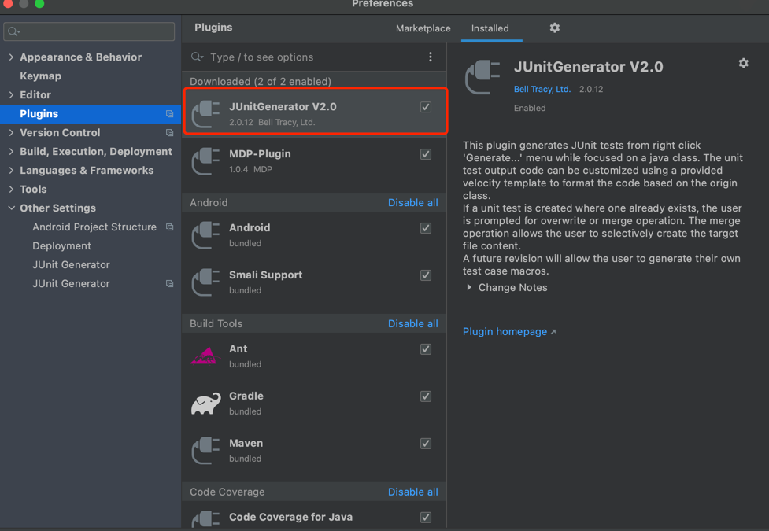
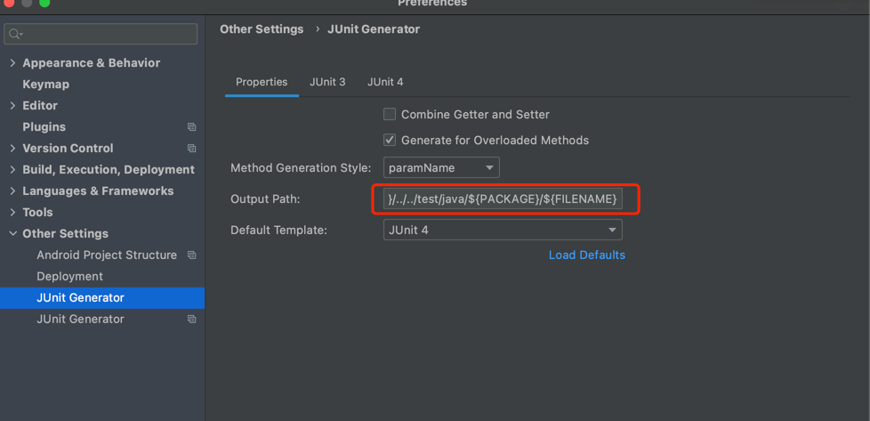

# 单元测试规范

## 为什么要写单测

保证代码运行符合预期，将代码中的问题提早暴露出来，减少代码bug，提高代码质量。

## 什么是单测

单元测试(unit test)是指程序员对代码中的最小运行单元进行正确性检验的测试。

## 怎么写单元测试

针对每个方法都要有单元测试

>包括private方法

针对每行代码都要有单元测试

>包括if else 里的逻辑，包括catch里的逻辑

针对每个业务场景写

>包括异常合法的场景、不合法的场景,成功的场景、失败的场景

## 单元测试的步骤

  Setup，初始化，准备数据等

>初始化数据

  Execute，调用要测试的方法、函数

>组装并执行测试方法

  Verify，验证结果是否符合预期

​	将结果进行验证，这里一定要Verify，不要System.out.println()结果。Verify是一个验证过程，这个会影响CI的执行。

  Teardown，重置状态

>单测的数据不能产生其他影响，以免干扰到其他测试，所以测试结束后一定要重置状态。
>
>一般都是将数据做隔离，以免减少数据的干扰。

## 单元测试的规范

  1. 测试类与实际类在相同包下，只是测试类是在测试包下

  2. 测试类名称为实际类名称+Test

    如：UserDaoTest

  3. 测试类方法为test+实际类方法

    如：testLogin_Success,testLogin_Failed……

## 单元测试的技术

### IDEA自动生成

1. 安装junitgenerator-v2插件，然后重启IDEA

   

2. 设置junit4模板

    基本不用调整，可以根据自己的规范，添加一些类注释，修改一下样式。

3. 设置文件生成路径

    

        ${SOURCEPATH}/../../test/java/${PACKAGE}/${FILENAME}

### Mock技术

  Mock是一种模拟行为，而不是真实的做相关操作。
  对那些不容易构建的对象用一个虚拟对象来代替测试的方法就叫mock测试。以此来提高单测的"单一"特性。

  Mock一般用于：

>复杂的业务系统
>
>外部服务调用

  Mock的优点：

>团队可以并行工作
>
>为无法访问的资源编写测试
>
>系统进行隔离

#### Mockito

  Mockito 是一个基于MIT协议的开源java测试框架。 Mockito区别于其他模拟框架的地方主要是允许开发者在没有建立“预期”时验证被测系统的行为。对mock对象的一个批评是测试代码与被测系统高度耦合，由于Mockito试图通过移除“期望规范”来去除expect-run-verify模式（期望--运行--验证模式），因此使耦合度降低到最低。

    <dependency>
      <groupId>org.mockito</groupId>
      <artifactId>mockito-all</artifactId>
      <scope>test</scope>
    </dependency>

  需要注意的语句：

    Mockito.when(A).thenReturn(B);

  需要注意的注解：

    @InjectMocks
  说明：该注解跟@Autowired类似，注入一个服务。

    @MockBean
  说明：注入一个服务，该服务会是“假对象”，并不会真正执行。

### 数据库H2

H2数据库是一个开源的关系型数据库。H2是一个采用java语言编写的嵌入式数据库引擎，只是一个类库（即只有一个 jar 文件），可以直接嵌入到应用项目中，不受平台的限制。

之所以需要H2数据库，主要是为了与其他数据库无任何干扰，从而保证测试的可靠性。

引入：

    <dependency>
        <groupId>com.h2database</groupId>
        <artifactId>h2</artifactId>
        <scope>runtime</scope>
    </dependency>

配置：

    spring.datasource.platform=h2  #表明使用的数据库平台是h2
    spring.datasource.url=jdbc:h2:./data/test;AUTO_SERVER=TRUE
    spring.datasource.username=sa
    spring.datasource.password=123456
    spring.datasource.driverClassName=org.h2.Driver

### 内嵌Redis

  很多应用中会使用到Redis。而单测的时候如果把数据写入Redis或者读取Redis的数据，可能会造成一些脏数据，从而影响单测的结果。
  所以我们需要使用内嵌Redis。

      <dependency>
          <groupId>com.github.kstyrc</groupId>
          <artifactId>embedded-redis</artifactId>
          <version>0.6</version>
      </dependency>

  一般我们在写单元测试的时候，会在一个测试类中写很多的测试方法。那么我们一般会选择在@Before方法中启动RedisServer，在@After方法中进行close。
  启动与关闭：

    redisServer = new RedisServer(6379);
    redisServer.start();
    // do something
    redisServer.stop();

### 单元测试的问题

#### 1.加载慢的问题

原因分析：

  首先每一次单测都需要重新加载数据，跑完一次程序就结束了，所以每次测试方法时都要重新加载数据。

实现方式：

#### 2.分库分表的问题

