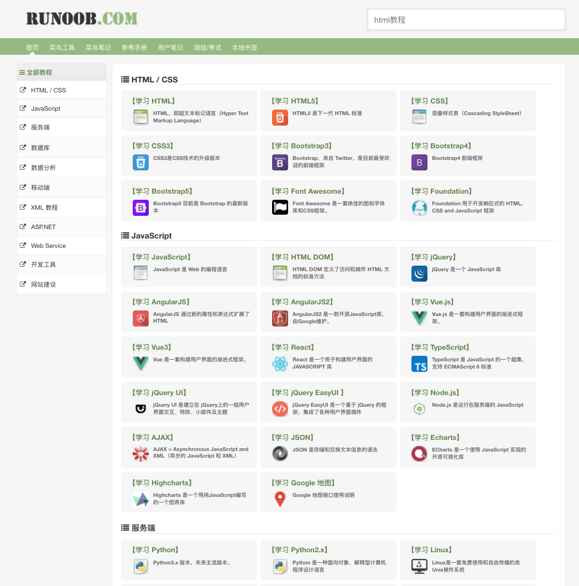

# 常用网站

## 1.StackOverFlow

[https://stackoverflow.com/](https://stackoverflow.com/)

stackoverflow是全世界最活跃的技术问答交流社区，如果你还不知道，那你就out了！作为出入技术的人，我强烈建议学会使用，并习惯使用这个网站。在这里全球的工程师都可以为你提供帮助。

这是个英文网站，很多问题和回答都是英文的，所以首先养成用英文来搜索你的问题。

## 2.github

[https://github.com/](https://github.com/)

GitHub是一个面向开源及私有软件项目的托管平台。可以通过github审查代码、管理项目，同时与数百万IT技术人员一起交流，开发软件。

GitHub上有很多优秀开源项目和教程资源值得你去发现、学习。如果现在真的有元宇宙，Github就是元宇宙。

2019年Github宣布，准备启动GitHub北极代码库项目。

Github认为，代码是现代文明的隐藏基石，也是全人类的共同遗产，而**GitHub Archive Program（GitHub存档程序）**的任务就是为后代保留开源软件。

**GitHub Arctic Code Vault**将存储在北极世界档案馆中，它位于挪威斯瓦尔巴群岛的一个废弃煤矿冻土区下的250米深处，这比北极圈更靠近北极。Github会以二维码的形式将代码快照存放在胶片中，据称胶片寿命长达 1000 年，并且此后每5年便会更新一次代码。

## 3.leetcode

[https://leetcode.com/](https://leetcode.com/)

力扣 LeetCode ，全球 IT 人才职业技能成长平台，提供海量技术面试资源，助你高效提升编程技能，轻松拿下 IT 名企 Dream Offer。作为全球早期诞生的 OJ 平台之一，力扣的影响力及知名度遍及全球程序员群体。

中文版地址：[https://leetcode-cn.com/](https://leetcode-cn.com/)
## 4.Hacker News

[https://news.ycombinator.com/news](https://news.ycombinator.com/news)

Hacker News是Y Combinator旗下的一个新闻频道，它的界面非常丑陋（客观事实，你一看便知），但是社区用户质量、评论质量非常高。
如果你是科技行业从业者，无论是程序员、产品经理、PR、运营，这个网站都值得每天泡，它基本上代表了当今世界最高的科技圈人群。

“Hacker”一词，不是指中文语境下通常说的“黑客”，而是指一群用技术解决问题的人。
## 5.DZone

[https://dzone.com/](https://dzone.com/)
​     
DZone.com是世界上最大的在线社区之一，全世界的开发技术人员通过共享知识来了解最新的技术趋势，了解新技术，方法和最佳实践。
​     
DZone.com是世界最大的共享技术在线社区之一，在这里大家共享最新的技术知识和趋势，方法和最佳实践，所以想了解最心的技术，这个社区也是最好的渠道之一。

## 6.InfoQ

[https://www.infoq.com/](https://infoq.com/)

InfoQ是一家全球性在线软件开发与技术创新社区，包含有中文站,旨在通过促进软件开发领域知识与创新的传播，为软件开发者提供帮助。这个社区除了线上，线下也有大家熟知的大会，包括**QCon**、**ArchSummit**等。以及咱们熟知的一个APP——极客时间，也是他们公司的产品。

## 7.osChina

[https://oschina.com/](https://oschina.net/)

oschina是一个知名的中文开源技术交流社区，资讯、项目、问答、博客应有尽有。

2013年,开源中国建立大型综合性的云开发平台——码云(中国版github)，为中国广大开发者提供团队协作、源码托管、代码质量分析、代码评审、测试、代码演示平台等功能。

## 8.CSDN

[https://www.csdn.net/](https://www.csdn.net/)

CSDN是全球知名中文IT技术交流平台,包含原创博客、精品问答、职业培训、技术论坛、资源下载等产品服务,提供原创、优质、完整内容的专业IT技术开发社区。

## 9.菜鸟教程

[https://www.runoob.com/](https://www.runoob.com/)

菜鸟教程提供了编程的基础技术教程, 介绍了HTML、CSS、Javascript、Python,Java,Ruby,C,PHP , MySQL等各种编程语言的基础知识。新猿入园必备！

## 10.v2ex

[https://www.v2ex.com/](https://www.v2ex.com/)

人称V站，社区人员人称V友。在这里可以看到一些老一代程序员。

一个老牌的IT社区，国内最具影响力创意工作者社区、和开发人员交流社区。不过现在由于运营问题，逐步没落。

## 11.B站
[https://www.bilibili.com/](https://www.bilibili.com/)

惊不惊喜，意不意外？

B站，是一个神奇的网站！中国年轻世代高度聚集的文化社区和视频平台。目前可以名副其实地说是一个学习网站！

