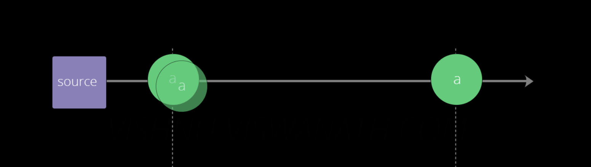
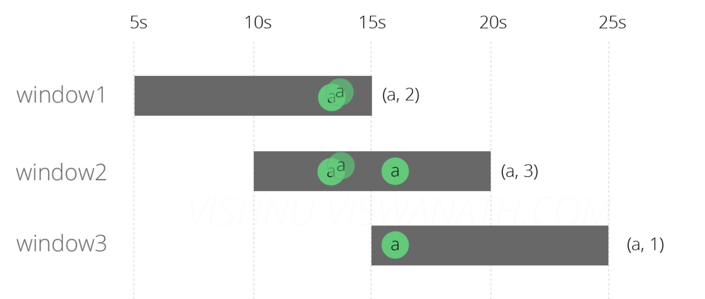
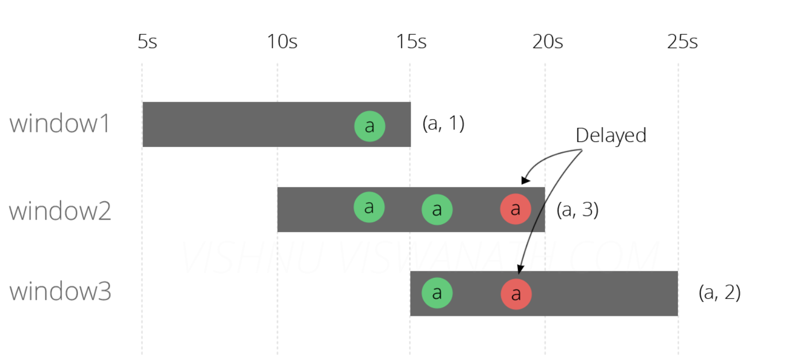
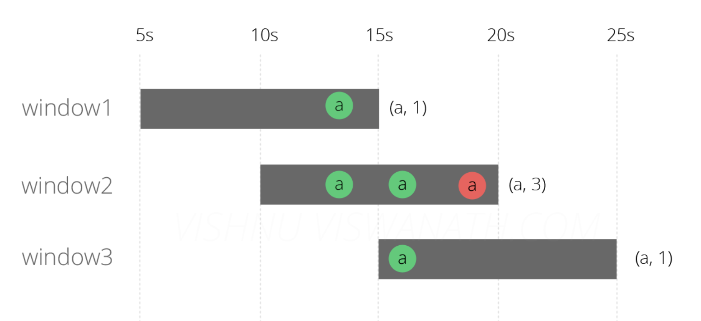
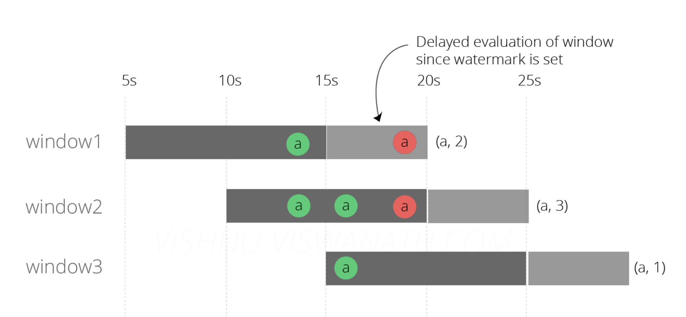

## 基于SpringBoot2.x、SpringCloud和SpringCloudAlibaba并采用前后端分离的企业级微服务多租户系统架构。并引入组件化的思想实现高内聚低耦合并且高度可配置化，适合学习和企业中使用。真正实现了基于RBAC、jwt和oauth2的无状态统一权限认证的解决方案，面向互联网设计同时适合B端和C端用户，支持CI/CD多环境部署，并提供应用管理方便第三方系统接入；同时还集合各种微服务治理功能和监控功能。模块包括:企业级的认证系统、开发平台、应用监控、慢sql监控、统一日志、单点登录、Redis分布式高速缓存、配置中心、分布式任务调度、接口文档、代码生成等等。Window(窗口)

Flink是一个流处理计算框架，它底层基于流处理引擎，实现了批处理与流处理，在流处理中，为了处理无限的数据集，使用window将无限的数据流切分多个有限的数据块进行计算。window就是从 Streaming 到 Batch 的一个桥梁。

我们按照具体的业务需求将window划分为KeyedWindow以及Non-KeyedWindow，如果是KeyedWindow那么它会有多个并行度来计算窗口中的数据，比如统计同一用户在5分钟内不同的登录IP地址数，对于Non-KeyedWindow的并行度则为1，比如统计5分钟内网站PV。

如下图所示：
:::center

:::
### Window的生命周期

当属于该窗口的第一个元素到达时就会创**建该窗口**，当时间(event/process time)超过窗口的**结束时间戳+用户指定的延迟时间**，窗口将被移除(仅限time-based window)。比如对于一个每5分钟创建Tumbling Windows(即滚动窗口)窗口，允许1分钟的时延，Flink将会在12:00到12:05这段时间内第一个元素到达时创建窗口，当watermark超过12:06时，该窗口将被移除。

除此之外，每个window还将有以下元素组成：

Window Trigger：指定了窗口函数在什么条件下可被触发，触发器还可以决定在创建和删除窗口之间的任何时间清除窗口的内容。在这种情况下，清除仅限于窗口中的元素，而不是窗口元数据。这意味着新数据仍然可以添加到该窗口中。比如当窗口中的元素个数超过4个时，或者当水印达到窗口的边界时―触发计算

Window Function：函数里定义了应用于窗口(Window)内容的计算逻辑

Evictor(驱逐者)：将在触发器触发之后或者在函数被应用前后，清除窗口中的元素

### Window Assigner

Flink中的窗口分为两种，一种窗口是基于时间驱动的（Time Window，例如：每30秒钟），另外一种是基于数据驱动的（Count Window，例如：每5000条数据）。

在Flink流式计算中，通过windows assigner 将数据分配到不同的窗口，根据windows assigner 数据分配方式的不同將windows分为4大类，分别是：

滚动窗口（Tumbling Window，无重叠）

滑动窗口（Sliding Window，有重叠）

会话窗口（Session Window，活动间隙）

全局窗口 （Global Window，无时间周期）

#### 滚动窗口

滚动窗口是根据固定时间或大笑进行切分，且窗口与窗口之间的数据不重叠。这种类型的窗口的最大特点就是简单，可能会导致某些有前后关系的数据计算结果不正确，而对于按照固定大小和周期统计某一指标的这种类型的窗口计算比较合适，实现起来比较方便。使用场景：每1分钟的PV等
:::center

:::
#### 滑动窗口

滑动窗口也是一种比较常见的窗口类型，其特点是在滚动窗口的基础上增加了窗口的滑动时间（slide time），且允许窗口数据发生重叠。当window size固定之后，窗口并不像滚动窗口按照window size 向前移动，而是根据设定的slide time向前移动。使用场景：每隔30s统计最近10分钟内的活跃用户数等
:::center

:::
#### 会话窗口

会话窗口主要是将某段时间内活跃度较高的数据聚合成一个窗口进行计算，窗口触发条件是Session Gap，是指在规定的时间内如果诶呦数据活跃接入，则认为窗口结束，然后触发窗口计算结果。如果数据一直不断的进入窗口，也会导致窗口始终不触发的情况。与滑动窗口、滚动窗口不同的是，Session Windows不需要固定的window size和silde time，只需要定义session gap，来规定不活跃数据的时间上限即可。使用场景：IM会话消息及时回复统计等
:::center

:::
#### 全局窗口

全局窗口将所有相同的key的数据分配到单个窗口中计算结果，窗口没有开始和结束时间，窗口借助于Triger来触发计算，如果不对Global Windows指定Triger，则窗口不会触发计算。因此全局窗口使用一定要慎重，需要非常明确自己在整个窗口中统计出的结果是什么，并指定对应的触发器同时还需要有指定对应的数据清理机制，否则数据将一直留在内存中。
:::center

:::

## Time(时间)

### 时间概念

Flink 在流处理节目中支持不同的*时间*概念。

**处理时间（Processing time）**

处理时间是指执行相应机器的操作系统时间。

处理时间是最简单的时间概念，不需要流和机器之间的协调。它提供最佳性能和最低延迟。但是，在分布式和异步环境中，处理时间不提供确定性，因为它容易受到记录到达系统的速度（例如从消息队列）到记录在系统内的算子之间流动的速度的影响。

**事件时间（Event time）**

事件时间是事件在现实世界中发生的时间。

事件时间程序必须指定如何生成**事件时间水印**，这是表示事件时间进度的机制。假设所有数据都已到达，事件时间 算子操作将按预期运行，即使在处理无序或延迟事件或重新处理历史数据时也会产生正确且一致的结果。

**摄取时间（Ingestion time）**

摄取时间是事件进入Flink的时间。

*摄取时间*在概念上位于*事件时间*和*处理时间之间*。与*处理时间*相比 ，可以提供更可预测的结果。因为摄取时间使用稳定的时间戳（在源处分配一次），所以对记录的不同窗口 算子操作将引用相同的时间戳，而在*处理时间中，*每个窗口算子可以将记录分配给不同的窗口（基于本地系统时钟和任何运输延误）。与*事件时间*相比，*摄取时间*程序无法处理任何无序事件或后期数据，但程序不必指定如何生成*水印*。

三者之间的关系，如下图所示：
:::center

:::
代码示例：

```java
StreamExecutionEnvironment env = StreamExecutionEnvironment.getExecutionEnvironment();
// 处理时间
env.setStreamTimeCharacteristic(TimeCharacteristic.ProcessingTime);
// 摄取时间
//env.setStreamTimeCharacteristic(TimeCharacteristic.IngestionTime);
//事件事件
//env.setStreamTimeCharacteristic(TimeCharacteristic.EventTime);
```

### 使用案例

接下来通过一个例子了解**Processing time**和**Event time**的使用场景。

**需求描述**：每5s钟统计一次最近10s的消息量

**实现方案**：我们将创建一个大小为10秒的SlidingWindow，每5秒滑动一次，在窗口结束时，系统将发出在此期间收到某个消息的数量。

**技术实现**：

#### 一、基于Processing time实现

```java
final StreamExecutionEnvironment env = StreamExecutionEnvironment.getExecutionEnvironment();
env.setStreamTimeCharacteristic(TimeCharacteristic.ProcessingTime);
//连接socket获取输入的数据
DataStreamSource<String> text = env.socketTextStream("localhost", 9000, "\n");
DataStream<WordWithCount> windowCount = text.flatMap(new FlatMapFunction<String, WordWithCount>() {
            public void flatMap(String value, Collector<WordWithCount> out) throws Exception {
                String[] splits = value.split("\\s");
                for (String word:splits) {
                    out.collect(new WordWithCount(word,1L));
                }
            }
        })//打平操作，把每行的单词转为<word,count>类型的数据
                .keyBy("word")//针对相同的word数据进行分组
                .timeWindow(Time.seconds(10),Time.seconds(5))//指定计算数据的窗口大小和滑动窗口大小
                .sum("count");
//把数据打印到控制台
windowCount.print()
             .setParallelism(1);//使用一个并行度
env.execute("ProcessingTime processing example")
```

基于以上代码，假设数据源分别在时间，第13秒，第13秒和第16秒产生类型三条消息a。
:::center

:::
**场景一：**消息准时到达

窗口1[5s-15s]：第15秒的时候结束:13秒产生的两条消息，总和为2；

窗口2[10s-20s]：第20秒的时候结束:13秒产生的两条消息，16秒产生的一条消息，总和为3；

窗口3[15s-25s]：第25秒的时候结束:16秒产生的一条消息，总和为1。
:::center

:::
至此，需求完成了，是不是很开心？不要高兴的太早哦，问题来了。

**场景二：**消息阻塞到达

如果由于网路阻塞，服务器资源问题，导致中间第13秒的消息延迟了6秒到第19秒了会是什么样呢？

窗口1[5-15]：第15秒的时候结束:13秒产生的一条消息，总和为1；

窗口2[10-20]：第20秒的时候结束:13秒产生的两条消息，16秒产生的一条消息，19秒的一条消息，总和为3；

窗口3[15-25]：第25秒的时候结束:16秒产生的一条消息，19秒一条消息，总和为2。
:::center

:::


是不是很郁闷。好好的一个程序竟然跑出了bug？

那么怎么解决呢？于是就有了下面的方案。

#### 二、基于Event time实现

现在在每个消息里添加一个timestamp字段作为eventTime（事件发生时间）。

基于上面的场景二消息阻塞了，我们继续讨论，消息二延迟了6秒，到第19秒了。然后Event time 该如何处理呢？

窗口1[5s-15s]：第15秒的时候结束:13秒产生的一条消息，总和为1；

窗口2[10s-20s]：第20秒的时候结束:13秒产生的两条消息，16秒产生的一条消息，19秒的一条消息，发现eventTime在【10-20】之间，记为有效，总和为3；

窗口3[15s-25s]：第25秒的时候结束:16秒产生的一条消息，19秒的一条消息，发现eventTime不在【15-25】之间，记为无效，总和为1。
:::center

:::
到此发现窗口2和3是正确的，窗口1的结果依然不正确。

还不对？那该怎么办呢？

于是引出了上文说的**水印（Watermark）**：A **Watermark(t)** declares that event time has reached time *t* in that stream, meaning that there should be no more elements from the stream with a timestamp *t’ <= t*。什么意思呢？就是一个标志，标志某个时间以前的数据已经处理完了。换句话说，就是告诉Flink需要延迟多久结算。而结算后就不再计算之前的数据了。

OK，明白了这个概念之后，我们就可以去设置Flink的水印时间为当前时间前5秒。

窗口1[5s-15s]：第20秒的时候结束:13秒产生的一条消息，19秒的一条消息发现eventTime在【10-20】之间，记为有效，总和为2；

窗口2[10s-20s]：第20秒的时候结束:13秒产生的两条消息，16秒产生的一条消息，19秒的一条消息，发现eventTime在【10-20】之间，记为有效，总和为3；

窗口3[15s-25s]：第25秒的时候结束:16秒产生的一条消息，19秒的一条消息，发现eventTime不在【15-25】之间，记为无效，总和为1。
:::center

:::
至此，我们得到了最后的正确的结果。

如何去指定watermarker呢？只需要在创建source的时候声明watermarker即可，而水印设置的大小与准确性和实效性之间权衡。关于水印的更多内容，我们后面会做更多分享。

```java
DataStreamSource<String> text = (DataStreamSource<String>) env.socketTextStream("localhost", port, "\n")
                .assignTimestampsAndWatermarks(new AscendingTimestampExtractor<String>() {
                    @Override
                    public long extractAscendingTimestamp(String s) {
                        return 0;
                    }
                });
```


#### FlinkSQL的实现方式

在flink1.10之后，对SQL做了更好的支持，通过SQL的方式实现，简单介绍一下：

```sql
#1、声明source
CREATE TABLE test_source (
		word VARCHAR,
	ts BIGINT COMMENT '时间戳',
    #event time
	t as TO_TIMESTAMP(FROM_UNIXTIME(ts,'yyyy-MM-dd HH:mm:ss')),
    #processing time
	proctime as PROCTIME(),
    #水印
	WATERMARK FOR t AS t - INTERVAL '1' SECOND
) WITH(
'connector.type' ='kafka',
'connector.version' = 'universal',
'connector.properties.zookeeper.connect' = 'zkAddress',
'connector.properties.bootstrap.servers' = 'kafkaAddress',
'connector.properties.group.id' = 'group',
'connector.topic' ='topic',
'format.type' = 'json',
'update-mode' = 'append',
'connector.startup-mode' = 'earliest-offset'
);

#2、统计数据
SELECT
    DATE_FORMAT(HOP_END(t, INTERVAL '1' minute ), 'yyyy-MM-dd HH:mm:ss') dt,
    COUNT(*) AS num
  FROM test_source
  GROUP BY HOP(t, INTERVAL '10' second,INTERVAL '5' second );
```

怎么样，写过SQL的童鞋，是不是感觉很easy！！！

## State(状态)

为了保证程序的容错恢复以及程序启动时其状态恢复，Flink提供了Checkpoint和Savepoint机制来进行数据和状态的存储和恢复。

### Checkpoint检查点机制

一个问题：FlinkJob在执行过程中突然挂了，然后恢复后如何保证数据的准确性？

**Flink Checkpoint** 就是解决的这个问题。当程序出错时，可以从上一次的快照中恢复所有的算子之前的状态，从而保证数据的一致性。例如在KafkaConsumer算子中维护offset状态，当系统出现问题无法从Kafka中消费数据时，可以将Offset记录在状态中，当任务重新恢复时就能够从指定的偏移量开始消费数据。

那么，它是怎么记录中间状态的呢？

Flink会在输入的数据集上间隔性地生成checkpoint barrier，通过barrier将间隔时间段内的数据划分到相应的checkpoint中。

它会不会带来性能的损失？

任何运算都会带来能量消耗，不过Flink Checkpoint对于状态占用空间较小的应用，快照产生过程非常轻量，高频率创建对Flink任务性能影响相对较小。checkpoint过程中状态数据一般保存在一个可配置的环境中，通常是JobManager节点或HDFS上。

#### Flink Checkpoint 语义

Flink Checkpoint 支持两种语义：**Exactly Once** 和 **At least Once，**默认的 Checkpoint 模式是 Exactly Once. Exactly Once 和 At least Once 具体是针对 Flink **状态** 而言。具体语义含义如下：

**Exactly Once** 含义是：保证每条数据对于 Flink 的状态结果只影响一次。打个比方，比如 WordCount程序，目前实时统计的 "hello" 这个单词数为5，同时这个结果在这次 Checkpoint 成功后，保存在了 HDFS。在下次 Checkpoint 之前， 又来2个 "hello" 单词，突然程序遇到外部异常容错自动回复，从最近的 Checkpoint 点开始恢复，那么会从单词数 5 这个状态开始恢复，Kafka 消费的数据点位还是状态 5 这个时候的点位开始计算，所以即使程序遇到外部异常自我恢复，也不会影响到 Flink 状态的结果。

**At Least Once** 含义是：每条数据对于 Flink 状态计算至少影响一次。比如在 WordCount 程序中，你统计到的某个单词的单词数可能会比真实的单词数要大，因为同一条消息，你可能将其计算多次。

Exactly Once 和 At Least Once 具体在底层实现大致相同，具体差异表现在 Barrier 对齐方式处理：

如果是 Exactly Once 模式，某个算子的 Task 有多个输入通道时，当其中一个输入通道收到 Barrier 时，Flink Task 会阻塞处理该通道，其不会处理这些数据，但是会将这些数据存储到内部缓存中，一旦完成了所有输入通道的 Barrier 对齐，才会继续对这些数据进行消费处理。

对于 At least Once,同样针对某个算子的 Task 有多个输入通道的情况下，当某个输入通道接收到 Barrier 时，它不同于Exactly Once,At Least Once 会继续处理接受到的数据，即使没有完成所有输入通道 Barrier 对齐。所以使用At Least Once 不能保证数据对于状态计算只有一次影响。


### Savepoint机制

另一个问题：Flink集群需要升级、重启，重启后如何能保证数据的准确性？

**Flink Savepoint** 就是解决的这个问题。其主要目的就是帮助用户在升级和维护集群过程中保存系统中的状态数据，避免因为停机运维等正常终止应用的操作而导致系统无法恢复到原有的计算状态的情况。

它本质上是实时任务的全局镜像，其在底层使用的代码和Checkpoint的代码是一样的，因为Savepoint可以看做 Checkpoint在特定时期的一个状态快照。

#### Savepoint的操作：

1、手动触发Savepoints

2、取消任务并处罚Savepoints

3、通过从Savepoints中恢复任务

4、释放Savepoints数据

#### 存在的问题：

在Flink中默认支持自动生成Operator ID，但是这种方式不利于对代码层面的维护和升级，建议用户尽可能使用手工的方式对算子进行唯一ID标记，ID的应用范围在每个算子内部，可以通过使用Operator中提供的uid方法指定唯一ID，这样就能将算子唯一区分出来 。

Flink会在输入的数据集上间隔性地生成checkpoint barrier，通过barrier将间隔时间段内的数据划分到相应的checkpoint中。当程序出错时，可以从上一次的快照中恢复所有的算子之前的状态，从而保证数据的一致性。

例如在KafkaConsumer算子中维护offset状态，当系统出现问题无法从Kafka中消费数据时，可以将Offset记录在状态中，当任务重新恢复时就能够从指定的偏移量开始消费数据。


### 总结一下

**Flink Checkpoint 是一种容错恢复机制**。这种机制保证了实时程序运行时，即使突然遇到异常也能够进行自我恢复。Checkpoint 对于用户层面，是透明的，用户会感觉程序一直在运行。Flink Checkpoint 是 Flink 自身的系统行为，用户无法对其进行交互，用户可以在程序启动之前，设置好实时程序 Checkpoint 相关参数，当程序启动之后，剩下的就全交给 Flink 自行管理。当然在某些情况，比如 Flink On Yarn 模式，某个 Container 发生 OOM 异常，这种情况程序直接变成失败状态，此时 Flink 程序虽然开启 Checkpoint 也无法恢复，因为程序已经变成失败状态，所以此时可以借助外部参与启动程序，比如外部程序检测到实时任务失败时，从新对实时任务进行拉起。

**Flink Savepoint 你可以把它当做在某个时间点程序状态全局镜像，以后程序在进行升级，或者修改并发度等情况，还能从保存的状态位继续启动恢复**。如果是用户自定义开发的实时程序，比如使用DataStream进行开发，建议为每个算子定义一个 uid，这样我们在修改作业时，即使导致程序拓扑图改变，由于相关算子 uid 没有变，那么这些算子还能够继续使用之前的状态，如果用户没有定义 uid ， Flink 会为每个算子自动生成 uid，如果用户修改了程序，可能导致之前的状态程序不能再进行复用。

**Flink Checkpoint和Savepoint对比：**

1. 概念：Checkpoint 是 自动容错机制 ，Savepoint 程序全局状态镜像 。
2. 目的： Checkpoint 是程序自动容错，快速恢复 。Savepoint是 程序修改后继续从状态恢复，程序升级等。
3. 用户交互: Checkpoint 是 Flink 系统行为 。Savepoint是用户触发。
4. 状态文件保留策略：Checkpoint默认程序删除，可以设置CheckpointConfig中的参数进行保留 。Savepoint会一直保存，除非用户删除 。
